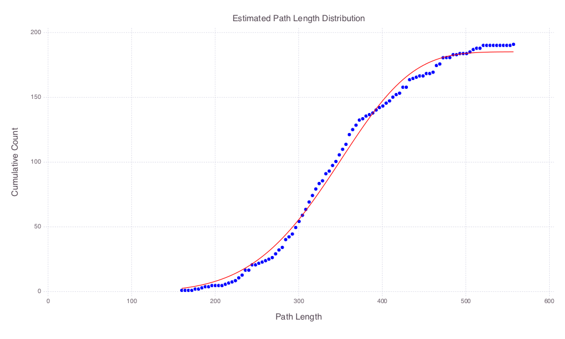

# PathDistribution.jl

<!--
[](http://pkg.julialang.org/?pkg=RobustShortestPath&ver=0.3)
[](http://pkg.julialang.org/?pkg=RobustShortestPath&ver=0.4)
-->

[](https://travis-ci.org/chkwon/PathDistribution.jl)
[](https://ci.appveyor.com/project/chkwon/pathdistribution-jl)
[](https://coveralls.io/github/chkwon/PathDistribution.jl?branch=master)


This Julia package implements the Monte Carlo path generation method to estimat the number of simple paths between a pair of nodes in a graph, proposed by Roberts and Kroese (2007).

* [Roberts, B., & Kroese, D. P. (2007). Estimating the Number of *s*-*t* Paths in a Graph. *Journal of Graph Algorithms and Applications*, 11(1), 195-214.](http://dx.doi.org/10.7155/jgaa.00142)

In addition, using the same idea, this package tries to estimate the path length distribution as follows. Let *n(x)* denote the cumulative number of paths whose length is no greather than *x*. We assume that *n(x)* is of the form:

```julia
n(x) = beta[1] * ( 1 - exp( - (x/beta[2])^beta[3] ) )
```

This package estimates ```beta``` using the [LsqFit.jl](https://github.com/JuliaOpt/LsqFit.jl) package.

## Installation

This package requires Julia version 0.4.

```julia
Pkg.clone("https://github.com/chkwon/PathDistribution.jl")
```

## Tutorial
There are two ways of using this package. When you are given an adjacency matrix of the form:

```julia
adj_mtx = [ 0 1 1 1 0 1 1 1 ;
            1 0 0 0 1 1 1 0 ;
            1 0 0 1 1 1 1 1 ;
            1 0 1 0 1 1 1 1 ;
            0 1 1 1 0 1 0 0 ;
            1 1 1 1 1 0 1 1 ;
            1 1 1 1 0 1 0 1 ;
            1 0 1 1 0 1 1 0 ]
```

and want to estimate the number of paths between node 1 and node 8, then

```julia
using PathDistribution
number_paths = monte_carlo_path_number(1, 8, adj_mtx)
```

or

```julia
using PathDistribution
number_paths, x_data, y_data = monte_carlo_path_distribution(1, 8, adj_mtx)
```
where `x_data` and `y_data` are for estimating the cumulative count of paths by path length. These data may be used to estimate `beta` in the function form `n(x)` as follows:

```julia
beta_est = path_distribution_fitting(x_data, y_data)
```


When you have the following form data:
```julia
data = [
 1   4  79.0 ;
 1   2  59.0 ;
 2   4  31.0 ;
 2   3  90.0 ;
 2   5   9.0 ;
 2   6  32.0 ;
 3   9  89.0 ;
 3   8  66.0 ;
 3   6  68.0 ;
 3   7  47.0 ;
 4   3  14.0 ;
 4   9  95.0 ;
 4   8  88.0 ;
 5   3  44.0 ;
 5   6  83.0 ;
 6   7  33.0 ;
 6   8  37.0 ;
 7  11  79.0 ;
 7  12  10.0 ;
 8   7  95.0 ;
 8  10   0.0 ;
 8  12  30.0 ;
 9  10   5.0 ;
 9  11  44.0 ;
10  13  79.0 ;
10  14  91.0 ;
11  14  53.0 ;
11  15  80.0 ;
11  13  56.0 ;
12  15  75.0 ;
12  14   1.0 ;
13  14  48.0 ;
14  15  25.0 ;
]

start_node = round(Int64, data[:,1]) #first column of data
end_node = round(Int64, data[:,2]) #second column of data
link_length = data[:,3] #third

origin = 1
destination = 15
```

then use the following function:
```julia
using PathDistribution
beta_est = path_distribution_fitting(origin, destination, start_node, end_node, link_length)
```
which is a shorthand for
```julia
no_path_est, x_data, y_data =
    monte_carlo_path_distribution(origin, destination, start_node, end_node, link_length)

beta_est = path_distribution_fitting(x_data, y_data)
```

Using [Gadfly.jl](http://gadflyjl.org) for example, one can create a plot as follows:
```julia
using Gadfly

x_fit = x_data
y_fit = cumulative_model(x_fit, beta_est)

fit_plot =
plot(
    layer(x=x_fit, y=y_fit, Geom.line, Theme(default_color=colorant"red") ) ,
    layer(x=x_data, y=y_data, Geom.point, Theme(default_color=colorant"blue") ) ,
    Guide.xlabel("Path Length"), Guide.ylabel("Cumulative Count"),
    Guide.title("Estimated Path Length Distribution"),
)

draw(PNG("fit_plot.png", 10inch, 6inch), fit_plot)
```
The result is

